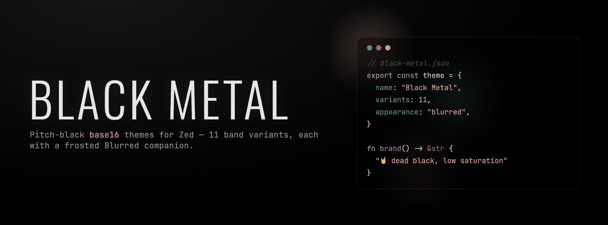

	

	
	
	

## Usage

1. Open Zed.
2. Open the command palette (<kbd>Cmd</kbd>+<kbd>Shift</kbd>+<kbd>P</kbd>) and enter _zed: extensions_.
3. Search for the _Black Metal_ extension and install.
4. Enter _theme selector: toggle_ and pick a variant.

## Development

`themes/black-metal.json` is generated. Edit `src/base.json` or drop a palette in `palettes/`, then run `just build`. Test with _zed: install dev extension_. See the [Zed docs](https://zed.dev/docs/extensions/developing-extensions).

&nbsp;

	Ported from <a href="https://github.com/metalelf0/base16-black-metal-scheme">base16-black-metal-scheme</a> by metalelf0

	

